# Engine Data Flows

Visual reference for every data path through the research engine. Diagrams use Mermaid
(renders in GitHub, VS Code, and most Markdown viewers). Each diagram annotates edge
labels with the concrete Python type crossing that boundary.

---

## 1. System Overview — All Components

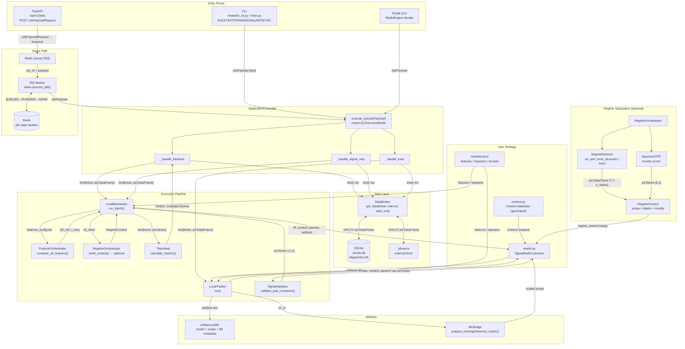

---

## 2. BACKTEST Path — Request to Tearsheet

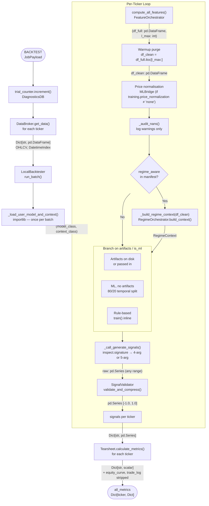

---

## 3. TRAIN Path — Request to Artifacts

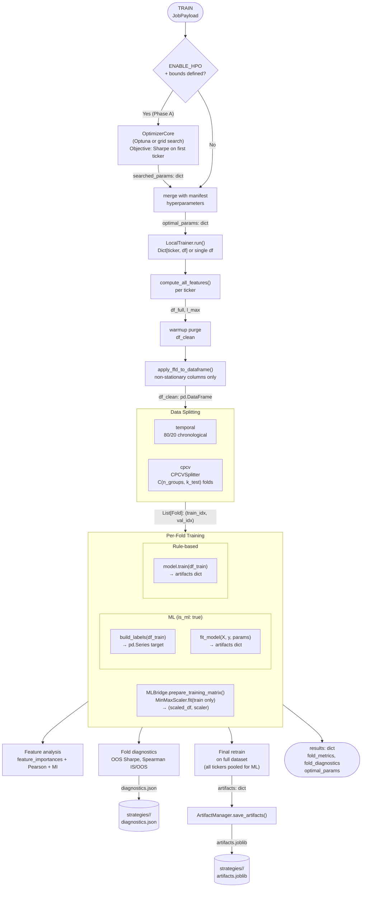

---

## 4. Feature Computation Pipeline

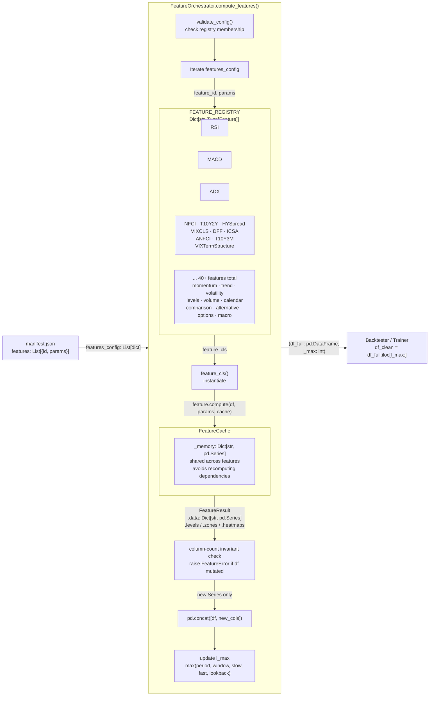

**Column naming convention:** `Feature.generate_column_name(feature_id, params, output_name)`
produces deterministic names: `RSI_14`, `BollingerBands_20_2.0_UPPER`, `MACD_SIGNAL`,
`T10Y2Y_level`, `T10Y2Y_roc5`, `T10Y2Y_zscore`, `VIXTermStructure`, `VIXTermStructure_zscore`.
Every run on the same manifest yields identical column names.

**Macro features note.** FRED and VIX term structure features fetch external data inside
`compute()` and align it to `df.index` via forward-fill — they require no changes to the
orchestrator. The `_level` output of every `FredFeature` subclass is declared non-stationary
via `non_stationary_outputs()`, so the ML bridge routes it through FFD before scaling.

---

## 5. Regime Detection Pipeline

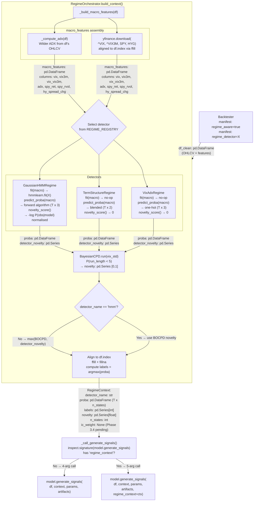

**BOCPD internals** (Adams & MacKay 2007, Normal-Gamma conjugate):

```
At each step t:
  1. Compute Student-T predictive P(x_t | run_length=r, history) for all r ∈ [0..mrl]
  2. Update run-length posterior R[r] via:
       growth:     R_new[r+1] = R[r] * pred[r] * (1 - H)
       changepoint: R_new[0]  = Σ_r R[r] * pred[r] * H
  3. Normalise R_new
  4. novelty[t] = Σ_{r<5} R_new[r]   (P that run started < 5 bars ago)
  5. Update Normal-Gamma sufficient stats {μ, κ, α, β} for surviving hypotheses
```

---

## 6. ML Bridge — Training and Inference Matrices

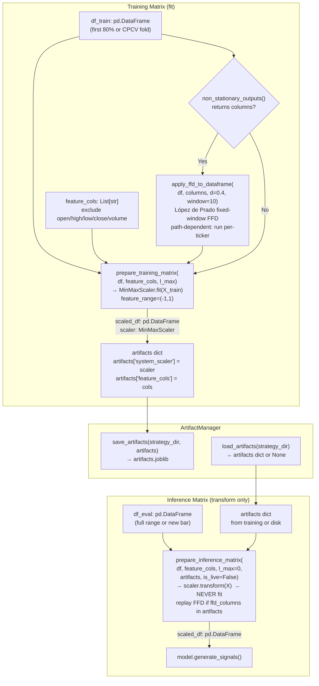

---

## 7. Data Broker — SQLite Caching Protocol

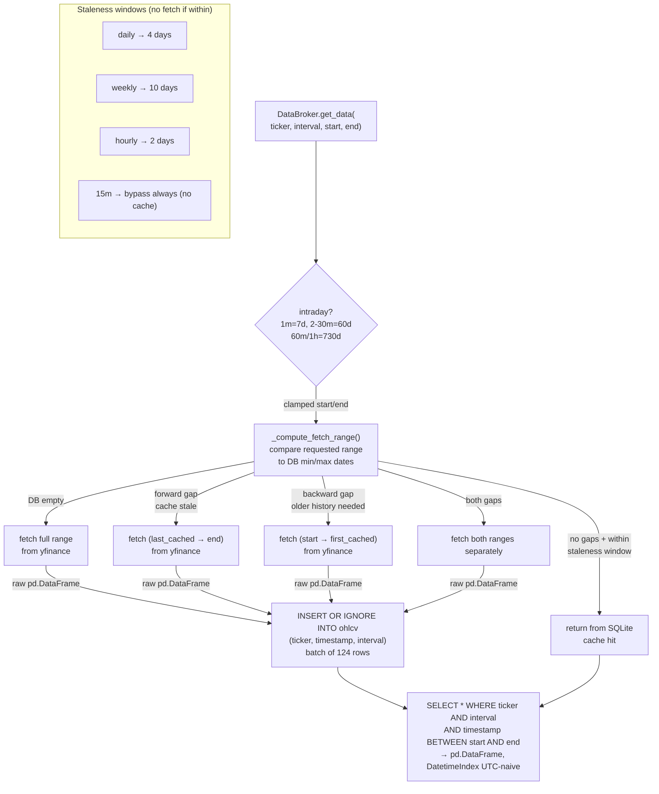

---

## 8. API and Worker — Redis State Machine

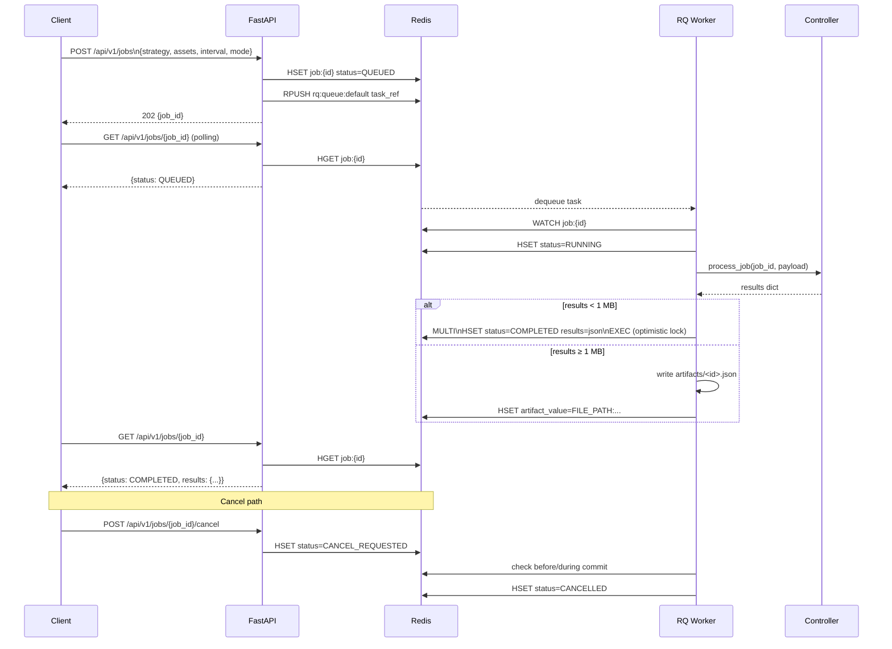

**Job state machine:**

```
QUEUED ──► RUNNING ──► COMPLETED
                  └──► FAILED
                  └──► CANCELLED  (via CANCEL_REQUESTED)
```

---

## 9. Training — CPCV Fold Structure

```mermaid
flowchart LR
    subgraph DATA["Full dataset (n bars)"]
        G1["Group 1"]
        G2["Group 2"]
        G3["Group 3"]
        G4["Group 4"]
        G5["Group 5"]
        G6["Group 6"]
    end

    subgraph FOLDS["C(6,2) = 15 folds  (n_groups=6, k_test=2)"]
        F1["Fold 1\ntest: G1+G2 | train: G3-G6"]
        F2["Fold 2\ntest: G1+G3 | train: G2,G4-G6"]
        DOTS2["... 13 more folds"]
        F15["Fold 15\ntest: G5+G6 | train: G1-G4"]
    end

    subgraph PURGE["Purge + Embargo per fold"]
        PG["Remove l_max bars before\neach test block (lookback leak)"]
        EM["Remove embargo_pct×n bars after\neach test block (label autocorrel)"]
    end

    DATA --> FOLDS
    FOLDS --> PURGE
    PURGE -->|"(X_train, y_train)\n(X_val, y_val)"| FIT["fit_model(X_train, y_train)\ngenerate_signals(X_val)\nTearsheet OOS metrics"]
    FIT -->|"fold_sharpe: float\nfold_artifacts"| AGG["aggregate across folds\nmean/std OOS metrics\nSpearman IS/OOS"]
    AGG --> FINAL["Final retrain\non full pooled data\nsave artifacts.joblib"]
```

---

## 10. Key Data Types Reference

| Type | Shape / Structure | Where produced | Where consumed |
|---|---|---|---|
| `JobPayload` | Pydantic model: strategy, assets, interval, mode, timeframe | CLI / API / GUI | `ApplicationController.execute_job()` |
| `pd.DataFrame` (OHLCV) | columns: open, high, low, close, volume; DatetimeIndex UTC-naive | `DataBroker.get_data()` | `LocalBacktester`, `LocalTrainer`, `FeatureOrchestrator` |
| `pd.DataFrame` (feature-enriched) | OHLCV + N feature columns; same DatetimeIndex | `FeatureOrchestrator.compute_features()` | `LocalBacktester.run()`, `RegimeOrchestrator`, `MLBridge` |
| `(pd.DataFrame, int)` | `(df_full, l_max)` | `compute_all_features()` | Backtester warmup purge |
| `FeatureResult` | dataclass: data, levels, zones, heatmaps | `Feature.compute()` | `FeatureOrchestrator` |
| `pd.DataFrame` (macro feature columns) | FRED / yfinance series as dated columns in the feature DataFrame: `<ID>_level`, `<ID>_roc5`, `<ID>_zscore`, `VIXTermStructure`, `VIXTermStructure_zscore` | `FredFeature.compute()`, `VIXTermStructure.compute()` via `FeatureOrchestrator` | `SignalModel.generate_signals()` via `df[ctx.features.<col>]` |
| `pd.DataFrame` (regime macro) | internal regime inputs — columns: vix, adx, spy_ret, spy_rvol, hy_spread_chg, vix_vix3m; **not** in the strategy DataFrame | `RegimeOrchestrator._build_macro_features()` (direct yfinance fetch, independent of FEATURE_REGISTRY) | `RegimeDetector.fit()`, `BayesianCPD.run()` |
| `RegimeContext` | dataclass: proba (T×K), labels (T,), novelty (T,), n_states | `RegimeOrchestrator.build_context()` | `SignalModel.generate_signals()` (opt-in) |
| `pd.DataFrame` (proba) | columns = int state IDs; index = df.index; row sums to 1.0 | `RegimeDetector.predict_proba()` | `RegimeContext` |
| `pd.Series` (novelty) | float in [0,1]; index = macro.index | `BayesianCPD.run()` | `RegimeContext.novelty`, `size_multiplier` |
| `pd.Series` (raw signals) | any numeric range; user-defined index | `SignalModel.generate_signals()` | `SignalValidator.validate_and_compress()` |
| `pd.Series` (signals) | float in [-1.0, 1.0]; index = df_clean.index | `SignalValidator.validate_and_compress()` | `Tearsheet.calculate_metrics()` |
| `artifacts` dict | `{"model": est, "system_scaler": scaler, "feature_cols": [...], ...}` | `model.train()` / `model.fit_model()` | `model.generate_signals()`, `ArtifactManager.save_artifacts()` |
| `numpy.ndarray` (X) | shape `(n_samples, n_features)`, float64, scaled to [-1,1] | `MLBridge.prepare_training_matrix()` | `model.fit_model()` |
| `numpy.ndarray` (y) | shape `(n_samples,)`, int labels | `model.build_labels()` | `model.fit_model()` |
| Tearsheet `dict` | scalar metrics + equity_curve, portfolio, bh_portfolio, trade_log | `Tearsheet.calculate_metrics()` | CLI output, GUI charts |
| `ICResult` | dataclass: mean_ic, ic_ir, ic_series[horizon], quintile_returns, ... | `ICAnalyzer.compute()` | `research_cli.py ic` report, `ConditionalIC` |
| `ConditionalICResult` | dataclass: bins (sorted RegimeBin list), diagnosis, unconditional_ic | `ConditionalIC.compute()` | `research_cli.py ic-surface` report |

---

## 11. Strategy Manifest → Context → Model Data Flow

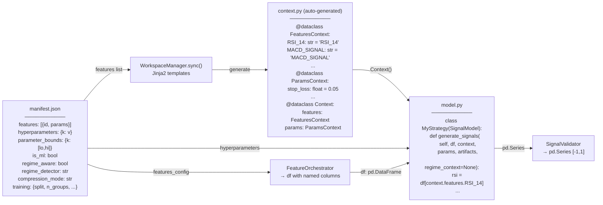

---

## 12. End-to-End Type Flow Summary

```mermaid
flowchart LR
    A(["User request\nstr: strategy\nList[str]: tickers\nstr: interval\nExecutionMode"]) 
    A -->|"JobPayload"| B["ApplicationController"]
    B -->|"ticker, interval, dates"| C["DataBroker"]
    C -->|"pd.DataFrame OHLCV\n(T rows × 5 cols)"| D["FeatureOrchestrator"]
    D -->|"pd.DataFrame\n(T rows × (5+N) cols)\nint: l_max"| E["LocalBacktester"]
    E -->|"pd.DataFrame\n(T-l_max rows × (5+N) cols)"| F{"regime_aware?"}
    F -->|"Yes → pd.DataFrame"| G["RegimeOrchestrator"]
    G -->|"RegimeContext\n(proba T×K, novelty T)"| H["SignalModel\n.generate_signals()"]
    F -->|"No → pd.DataFrame"| H
    H -->|"pd.Series (raw)"| I["SignalValidator"]
    I -->|"pd.Series [-1,1]\n(T-l_max,)"| J{"mode?"}
    J -->|"BACKTEST"| K["Tearsheet\n→ Dict[str, scalar]"]
    J -->|"SIGNAL_ONLY"| L["last value\nfloat + timestamp"]
    K --> M(["Result\nDict[ticker, metrics]"])
    L --> M
```
